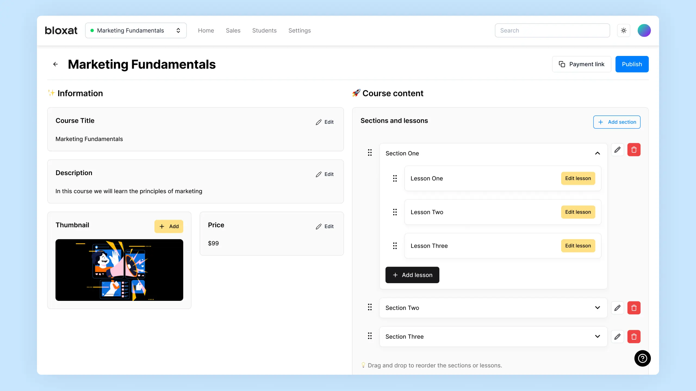

<h1 align="center">Bloxat LMS 🧱</h1>

<p align="center">
  <a href="https://teach.bloxat.app/" rel="noopener" target="_blank"></a>
</p>

<p align="center">
  
  
  
  
  
  
  
</p>

This repository contains the source code for Bloxat LMS, a Learning Management System designed for efficient education delivery and management.

## View Live Demo 🌐

To experience Bloxat LMS in action, visit [https://teach.bloxat.app/](https://teach.bloxat.app/).

## Features ✨

- 🖥️ **Intuitive Interface:** User-friendly interface for both instructors and students, facilitating seamless navigation and interaction.
- 👏 **Drag-and-Drop Functionality:** Utilizes DND-Kit to enable intuitive rearrangement of course elements and resources.
- 🌐 **Multilingual Support:** Implements i18next for easy localization and internationalization, supporting a diverse user base.
- 💳 **Payment Integration:** Seamlessly integrates with Paymob's API to facilitate secure transactions between teachers and students.
- 📱 **Responsive Design:** Tailwind CSS ensures a responsive and visually appealing layout across various devices and screen sizes.
- 📊 **Data Visualization:** Integrates Recharts for visually engaging representation of analytics and learning progress.
- 🔄 **State Management:** Utilizes Zustand for efficient state management, ensuring smooth performance and scalability.

## Getting Started 👇

To set up Bloxat LMS locally and explore its features, follow these steps:

1. **Clone the repository:**

```bash
git clone https://github.com/seifeldinio/bloxat-lms.git
```

2. **Install dependencies:**

```bash
cd bloxat-lms
npm install
```

3. **Start the development server:**

```bash
npm start
```

4. **Access Bloxat LMS:**

Open your web browser and navigate to `http://localhost:3000` to access Bloxat LMS locally.

### 📌 Note:

- The student portal exists in a separate codebase which you can find [here](https://github.com/seifeldinio/bloxat-portal).
- The live demo for the student portal is available [here](https://bloxat.app/).

## Troubleshooting ⚠️

If you encounter any issues during setup or usage of Bloxat LMS, consider the following troubleshooting tips:

- **Error Messages:** Pay attention to error messages displayed in the console and refer to relevant documentation or forums for solutions.
- **Dependencies:** Ensure all dependencies are correctly installed and up-to-date by running `npm install` and `npm update`.
- **Compatibility:** Check compatibility with your operating system, browser, and development environment to ensure smooth operation.
